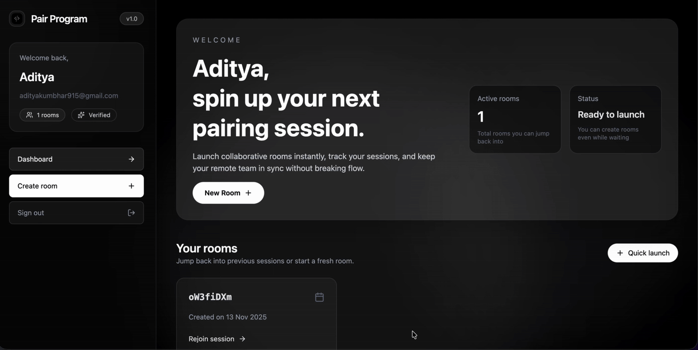
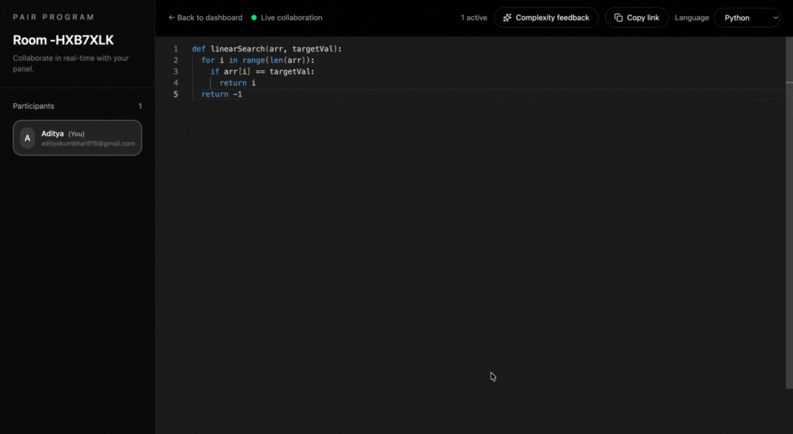

# Pair Program


## ✨ Live Demo
- Live Link: https://pair-program-eta.vercel.app/

## 🎥 Product Walkthrough
| Room creation | AI |
|-------|-------|
|  |  |


## 🧩 Features
- Real-time collaborative editor powered by Yjs + Monaco + Socket.IO
- Secure authentication (signup, login, email verification flow)
- Persistent room creation with short IDs & rejoin capability
- Participant panel with presence awareness (who's in the room)
- Language selector for editor syntax (JS/TS/Python/Java/C++/Go)
- Copy room link (one-click share for interviews)
- AI-generated time & space complexity feedback (Gemini model)
- Room deletion with confirmation dialog (custom shadcn-style)
- Toast notifications (custom implementation) replacing native alerts
- Responsive dark monochrome UI, minimal interview distraction design
- Verification email resend flow using Resend
- Secure JWT-based cookie sessions with production cross-origin handling

## 🛠️ Tech Stack
**Frontend**: React 19, Vite, TypeScript, Tailwind (v4), Framer Motion, Socket.IO client, Monaco Editor, Yjs, Custom Toast & Dialog components
**Backend**: Node.js, Express 5, TypeScript, Prisma, PostgreSQL (Supabase), Socket.IO, Yjs (document state), Resend (email), Google Gemini API
**Infra**: Render (backend), Vercel (frontend)

## 🗂️ Monorepo Structure
```
/backend
  src/
    controllers/      # Auth, room, feedback logic
    routes/           # Express routers
    middlewares/      # Auth middleware
    utils/            # Token, OTP, email helpers
    server.ts         # Express + Socket.IO bootstrap
  prisma/schema.prisma
/frontend
  src/pages/          # Landing, Auth, Rooms, Editor
  src/components/ui/  # Toast & AlertDialog components
  src/lib/utils.ts    # Tailwind class merge helper
```

## ⚙️ Environment Variables
Create `.env` files for both packages. Do NOT commit secrets.

### Backend `.env`
```
DATABASE_URL=postgresql://<user>:<password>@<host>:5432/<db>
JWT_SECRET=<<YOUR JWT SECRET>>
PORT=3000
RESEND_API_KEY=<<YOUR RESEND KEY>>
FRONTEND_URL=https://your-frontend.vercel.app
GEMINI_API_KEY=<<YOUR GEMINI KEY>>
```

### Frontend `.env`
```
VITE_BACKEND_URL=https://your-backend.onrender.com
```

## 🚀 Local Development
### Backend
```bash
cd backend
npm install
npx prisma generate
npm run dev
```
Backend runs (default) on `http://localhost:3000`.

### Frontend
```bash
cd frontend
npm install
npm run dev
```
Frontend runs on `http://localhost:5173`.

Ensure cookies are sent cross-origin (dev uses localhost). The backend CORS is configured to allow credentials.

## 🔐 Authentication Flow
1. User signs up → verification code emailed (Resend)
2. User verifies via link/code → `isVerified` updated
3. JWT cookie (`token`) set with `httpOnly`, `sameSite` conditional for production
4. Protected endpoints read `req.user` from middleware (token decode)

## 🧠 AI Feedback
- Endpoint: `POST /api/feedback` with `{ code }`
- Gemini response sanitized & JSON parsed; only complexity metrics displayed (raw JSON hidden)

## 🧪 Room Collaboration
- Socket.IO rooms keyed by `shortId`
- Yjs document per room stored in memory map
- Initial state sync via `encodeStateAsUpdate`
- Subsequent updates broadcast to participants

## 🧹 Deletion & Confirmation
Custom shadcn-style `AlertDialog` used for destructive room actions; no native alert usage.

## 📦 Production Deployment
### Backend (Render)
- Build command: `npm run build` (installs deps, Prisma generate, tsc)
- Start command: `npm start`
- Set env vars (including `FRONTEND_URL` & `NODE_ENV=production`)
- Ensure cookie settings allow `sameSite=none` & `secure=true`

### Frontend (Vercel)
- Build command: default `npm run build`
- Set `VITE_BACKEND_URL` to Render URL

## 🐛 Troubleshooting
| Issue | Cause | Fix |
|-------|-------|-----|
| 401 after deploy | Missing CORS origin or cookie `sameSite` mismatch | Set `FRONTEND_URL`, use `sameSite=none` in production |
| Gemini parsing fallback | Model wraps JSON in fences | Backend strips fences & extracts braces |
| TypeScript build fails on Render | Dev types not installed | Build script now installs dev deps |

## 🔭 Future Improvements (Placeholders)
- `<< ADDITIONAL FEATURE PLACEHOLDER >>`
- Collaborative cursor avatars & chat overlay
- Room archival & export (code snapshot)
- Rate limiting & audit logging
- Accessibility refinements & keyboard shortcuts


## 🙌 Contributing
1. Fork the repo
2. Create feature branch (`git checkout -b feat/your-feature`)
3. Commit changes (`git commit -m "feat: your feature"`)
4. Push & open PR


